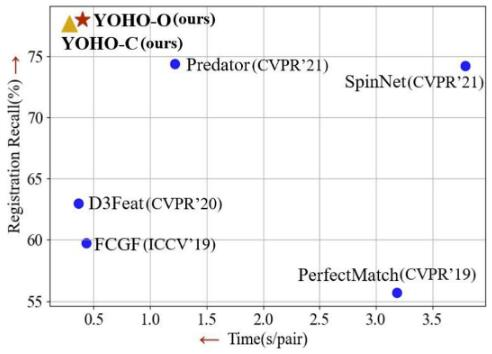
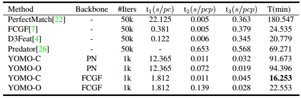

# You Only Hypothesize Once: Point Cloud Registration with Rotation-equivariant Descriptors

In this paper, we propose a novel local descriptor-based framework, called You Only Hypothesize Once (YOHO), for the registration of two unaligned point clouds. In contrast to most existing local descriptors which rely on a fragile local reference frame to gain rotation invariance, the proposed descriptor achieves the rotation invariance by recent technologies of group equivariant feature learning, which brings more robustness to point density and noise. Meanwhile, the descriptor in YOHO also has a rotation-equivariant part, which enables us to estimate the registration from just one correspondence hypothesis. Such property reduces the searching space for feasible transformations, thus greatly improves both the accuracy and the efficiency of YOHO. Extensive experiments show that YOHO achieves superior performances with much fewer needed RANSAC iterations on three widely-used datasets, the 3DMatch/3DLoMatch datasets and the ETH dataset.

## News

- 2021.7.6 The code of the FCGF backbone YOHO is released. [Project page](https://hpwang-whu.github.io/YOHO/)

## Performance and efficiency

(1)
(2)

## Requirements

Here we offer the FCGF backbone YOHO, so the FCGF requirements need to be met:

- Ubuntu 14.04 or higher
- CUDA 11.1 or higher
- Python v3.7 or higher
- Pytorch v1.6 or higher
- [MinkowskiEngine](https://github.com/stanfordvl/MinkowskiEngine) v0.5 or higher

## Installation

Create the anaconda environment:

```
conda create -n fcgf_yoho python=3.7
conda activate fcgf_yoho
conda install pytorch==1.7.1 torchvision==0.8.2 torchaudio==0.7.2 cudatoolkit=11.0 -c pytorch 
#We have checked pytorch1.7.1 and you can get the pytorch from https://pytorch.org/get-started/previous-versions/ accordingly.

#Install MinkowskiEngine, here we offer two ways according to the https://github.com/NVIDIA/MinkowskiEngine.git
(1) pip install git+https://github.com/NVIDIA/MinkowskiEngine.git
(2) #Or use the version we offer.
    cd MinkowskiEngine
    conda install openblas-devel -c anaconda
    export CUDA_HOME=/usr/local/cuda-11.1 #We have checked cuda-11.1.
    python setup.py install --blas_include_dirs=${CONDA_PREFIX}/include --blas=openblas
    cd ..

pip install -r requirements.txt
```

KNN build:

```
cd knn_search/
export CUDA_HOME=/usr/local/cuda-11.1 #We have checked cuda-11.1.
python setup.py build_ext --inplace
cd ..
```


## Data Preparation

We need the 3DMatch dataset (Train, Test) and the 3DLoMatch dataset (Test).

We offer the origin train dataset containing the point clouds (.ply) and keypoints (.txt, 5000 per point cloud) here [TrainData](https://drive.google.com/file/d/1mfnGL8pRvc6Rw6m6YnvNKdbpGxGJ081G/view?usp=sharing). With which, you can train the YOHO yourself.

We offer the origin test datasets containing the point clouds (.ply) and keypoints (.txt, 5000 per point cloud) here [TestData](https://drive.google.com/file/d/1yyXueb9QmbYQAdxydRYShbcKPyCSsNgo/view?usp=sharing).

Please place the data to ```./data/origin_data``` for organizing the data structure as:

- data
  - origin_data
    -  3dmatch
        - sun3d-home_at-home_at_scan1_2013_jan_1
            - Keypoints
            - PointCloud
    - 3dmatch_train
      - bundlefusion-apt0
        - Keypoints
        - PointCloud
    - ETH
      - wood_autumn
        - Keypoints
        - PointCloud

## Train

To train YOHO yourself, you need to prepare the origin trainset with the backbone FCGF. We have retrained the FCGF with the rotation argument in [0,50] deg and the backbone model is in ```./model/backbone```. With the TrainData downloaded above, you can create the YOHO trainset with:

```
python YOHO_trainset.py
```

Warning: the process above needs 300G storage space.

The training process of YOHO is two-stage, you can run which with the commands sequentially:

```
python Train.py --Part PartI
python Train.py --Part PartII
```

We also offer the pretrained models in ```./model/PartI_train``` and ```./model/PartII_train```.

## Demo

With the pretrained models, you can try the YOHO by:

```
python YOHO_testset.py --dataset demo
python Demo.py
```

## Test on the 3DMatch and 3DLoMatch

With the TestData downloaded above, the test on 3DMatch and 3DLoMatch can be done by:

- Prepare testset

```
python YOHO_testset.py --dataset 3dmatch
```

- Eval the results:

```
python Test.py --Part PartI  --max_iter 1000 --dataset 3dmatch    #YOHO-C on 3DMatch
python Test.py --Part PartI  --max_iter 1000 --dataset 3dLomatch  #YOHO-C on 3DLoMatch
python Test.py --Part PartII --max_iter 1000 --dataset 3dmatch    #YOHO-O on 3DMatch
python Test.py --Part PartII --max_iter 1000 --dataset 3dLomatch  #YOHO-O on 3DLoMatch
```

where PartI is yoho-c and PartII is yoho-o, max_iter is the ransac times, PartI should be run first. All the results will be placed to ```./data/YOHO_FCGF```.


## Generalize to the ETH dataset

With the TestData downloaded above, without any refinement of the model trained on the indoor 3DMatch dataset,  the generalization result on the outdoor ETH dataset can be got by:

- Prepare testset

```
python YOHO_testset.py --dataset ETH --voxel_size 0.15
```

- Eval the results:

```
python Test.py --Part PartI  --max_iter 1000 --dataset 3dmatch --ransac_d 0.2 #YOHO-C on ETH
python Test.py --Part PartII --max_iter 1000 --dataset 3dmatch --ransac_d 0.2 #YOHO-O on ETH
```
Similarly, all the results will be placed to ```./data/YOHO_FCGF```.

## Related Projects

We thanks greatly for the FCGF, PerfectMatch and Predator for the backbone and the datasets.

- [FCGF](https://github.com/chrischoy/FCGF)
- [3DSmoothNet](https://github.com/zgojcic/3DSmoothNet) 
- [Predator](https://github.com/overlappredator/OverlapPredator) 

