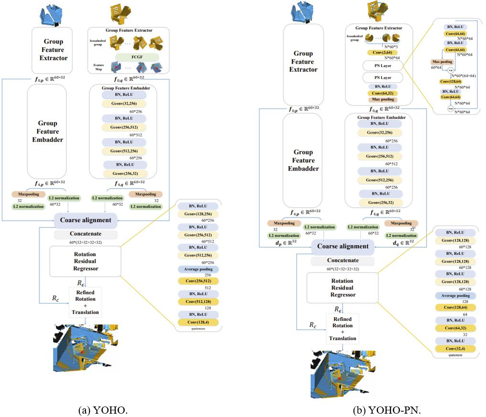

## You Only Hypothesize Once: Point Cloud Registration with Rotation-equivariant Descriptors
In this paper, we propose a novel local descriptor-based framework, called You Only Hypothesize Once (YOHO), for the registration of two unaligned point clouds. In contrast to most existing local descriptors which rely on a fragile local reference frame to gain rotation invariance, the proposed descriptor achieves the rotation invariance by recent technologies of group equivariant feature learning, which brings more robustness to point density and noise. Meanwhile, the descriptor in YOHO also has a rotation equivariant part, which enables us to estimate the registration from just one correspondence hypothesis. Such property reduces the searching space for feasible transformations, thus greatly improves both the accuracy and the efficiency of YOHO. Extensive experiments show that YOHO achieves superior performances with much fewer needed RANSAC iterations on four widely-used datasets, the 3DMatch/3DLoMatch datasets, the ETH dataset and the WHU-TLS dataset.

- [Preprint paper](https://arxiv.org/abs/2109.00182).
- [Project page](https://hpwang-whu.github.io/YOHO/).

## News
- 2021-09-01: The Preprint Paper is accessible on arXiv.
- 2021-07-06: YOHO using FCGF backbone is released.

## Performance


## Network Structure


## Requirements
Here we offer the FCGF backbone YOHO. Thus FCGF requirements need to be met:
- Ubuntu 14.04 or higher
- CUDA 11.1 or higher
- Python v3.7 or higher
- Pytorch v1.6 or higher
- [MinkowskiEngine](https://github.com/stanfordvl/MinkowskiEngine) v0.5 or higher

Specifically, The code has been tested with:
- Ubuntu 16.04, CUDA 11.1, python 3.7.10, Pytorch 1.7.1, GeForce RTX 2080Ti.

## Installation
- First, create the conda environment:
  ```
  conda create -n fcgf_yoho python=3.7
  conda activate fcgf_yoho
  ```

- Second, intall Pytorch. We have checked version 1.7.1 and other versions can be referred to [Official Set](https://pytorch.org/get-started/previous-versions/).
  ```
  conda install pytorch==1.7.1 torchvision==0.8.2 torchaudio==0.7.2 cudatoolkit=11.0 -c pytorch
  ```

- Third, install MinkowskiEngine for FCGF feature extraction, here we offer two ways according to [MinkowskiEngine](https://github.com/NVIDIA/MinkowskiEngine.git) by using the version we offered:
  ```
  cd MinkowskiEngine
  conda install openblas-devel -c anaconda
  export CUDA_HOME=/usr/local/cuda-11.1 #We have checked cuda-11.1.
  python setup.py install --blas_include_dirs=${CONDA_PREFIX}/include --blas=openblas
  cd ..
  ```
  Or following official command installation:
  ```
  pip install git+https://github.com/NVIDIA/MinkowskiEngine.git
  ```


- Fourth, install other packages, here we use 0.8.0.0 version [Open3d](http://www.open3d.org/) for Ubuntu 16.04:
  ```
  pip install -r requirements.txt
  ```

- Finally, compile the CUDA based KNN searcher:
  ```
  cd knn_search/
  export CUDA_HOME=/usr/local/cuda-11.1 #We have checked cuda-11.1.
  python setup.py build_ext --inplace
  cd ..
  ```

## Dataset & Pretrained model
The datasets and pretrained weights have been uploaded to Google Cloud:
- [3DMatch_train](https://drive.google.com/file/d/1mfnGL8pRvc6Rw6m6YnvNKdbpGxGJ081G/view?usp=sharing);
- [3DMatch/3DLomatch](https://drive.google.com/file/d/1UzGBPce5VspD2YIj7zWrrJYjsImSEc-5/view?usp=sharing);
- [ETH](https://drive.google.com/file/d/1hyurp5EOzvWGFB0kOl5Qylx1xGelpxaQ/view?usp=sharing);
- [WHU-TLS](https://drive.google.com/file/d/1QjlxIVMQPinNWt5LKhtaG9TTo2j3TGs_/view?usp=sharing);
- [Pretrained Weights](https://drive.google.com/file/d/1J-nkut2A66fyOQu0B0723yCfRiJLSG4O/view?usp=sharing). (Already added to the main branch.)

Also, all datas above can be downloaded in [BaiduDisk](https://pan.baidu.com/s/13GoHmTJ-jqg1zBgRbIUmNQ)(Code:0di4).

Datasets above contain the point clouds (.ply) and keypoints (.txt, 5000 per point cloud) files. Please place the data to ```./data/origin_data``` for organizing the data structure as:
- data
  - origin_data
    -  3dmatch
          - sun3d-home_at-home_at_scan1_2013_jan_1
              - Keypoints
              - PointCloud
    - 3dmatch_train
      - bundlefusion-apt0
        - Keypoints
        - PointCloud
    - ETH
      - wood_autumn
        - Keypoints
        - PointCloud
    - WHU-TLS
      - Park
        - Keypoints
        - PointCloud

Pretrained weights we offer include FCGF Backbone, Part I and Part II, which have been added to the main branch and organized following the structure as:
- model
  - Backbone
    - best_bal_checkpoint.pth
  - PartI_train
    - model_best.pth
  - PartII_train
    - model_best.pth


## Train
To train YOHO, the group input of train set should be prepared using the FCGF model we offer, which is trained with rotation argument in [0,50] deg, by command:
```
python YOHO_trainset.py
```
**Warning**: the process above needs 300G storage space.

The training of YOHO is two-stage, you can run which with the commands sequentially:
```
python Train.py --Part PartI
python Train.py --Part PartII
```

## Demo
With the Pretrained/self-trained models, you can try YOHO with:
```
python YOHO_testset.py --dataset demo
python Demo.py
```

## Test on the 3DMatch and 3DLoMatch
To evalute YOHO on 3DMatch and 3DLoMatch:
- Prepare the testset:
  ```
  python YOHO_testset.py --dataset 3dmatch --voxel_size 0.025
  ```
- Evaluate the results:
  ```
  python Test.py --Part PartI  --max_iter 1000 --dataset 3dmatch    #YOHO-C on 3DMatch
  python Test.py --Part PartI  --max_iter 1000 --dataset 3dLomatch  #YOHO-C on 3DLoMatch
  python Test.py --Part PartII --max_iter 1000 --dataset 3dmatch    #YOHO-O on 3DMatch
  python Test.py --Part PartII --max_iter 1000 --dataset 3dLomatch  #YOHO-O on 3DLoMatch
  ```
  Where PartI is YOHO-C and PartII is YOHO-O, max_iter is the ransac times, PartI should be run first. All results will be stored in ```./data/YOHO_FCGF```.


## Generalize to the ETH dataset
The generalization results on the outdoor ETH dataset can be got by:
- Prepare the testset: 
  ```
  python YOHO_testset.py --dataset ETH --voxel_size 0.15
  ```
  If out of memory, you can 
  - Change the parameter ```batch_size``` in ```YOHO_testset.py-->batch_feature_extraction()-->loader``` from 4 to 1 
  - Carry out the command scene by scene by controlling the scene processed now in ```utils/dataset.py-->get_dataset_name()-->if name==ETH```

- Evaluate the results:
  ```
  python Test.py --Part PartI  --max_iter 1000 --dataset ETH --ransac_d 0.2 --tau_2 0.2 --tau_3 0.5 #YOHO-C on ETH
  python Test.py --Part PartII --max_iter 1000 --dataset ETH --ransac_d 0.2 --tau_2 0.2 --tau_3 0.5 #YOHO-O on ETH
  ```
  All the results will be placed to ```./data/YOHO_FCGF```.


## Generalize to the WHU-TLS dataset
The generalization results on the outdoor WHU-TLS dataset can be got by:
- Prepare the testset:
  ```
  python YOHO_testset.py --dataset WHU-TLS --voxel_size 0.8
  ```
- Evaluate the results:
  ```
  python Test.py --Part PartI  --max_iter 1000 --dataset WHU-TLS --ransac_d 1 --tau_2 0.5 --tau_3 1 #YOHO-C on WHU-TLS
  python Test.py --Part PartII --max_iter 1000 --dataset WHU-TLS --ransac_d 1 --tau_2 0.5 --tau_3 1 #YOHO-O on WHU-TLS
  ```
  All the results will be placed to ```./data/YOHO_FCGF```.


## Related Projects
We sincerely thank the excellent projects:
- [EMVN](http://github.com/daniilidis-group/emvn) for the group details;
- [FCGF](https://github.com/chrischoy/FCGF) for the backbone;
- [PerfectMatch](https://github.com/zgojcic/3DSmoothNet) for the 3DMatch and ETH dataset;
- [Predator](https://github.com/overlappredator/OverlapPredator) for the 3DLoMatch dataset;
- [WHU-TLS](https://www.sciencedirect.com/science/article/pii/S0924271620300836)  for the WHU-TLS dataset.

